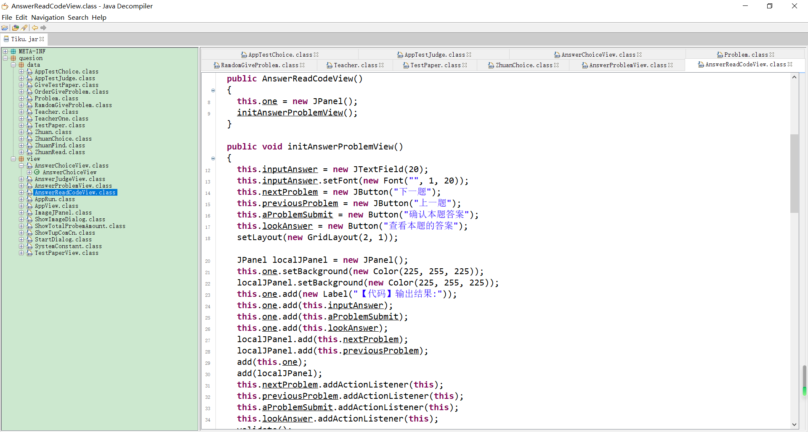

题库链接: https://pan.baidu.com/s/1QRMfkJWUWN6F-dP5GaQ8jQ    &emsp;&emsp;提取码：eus0 
jd-gui反编译工具链接: https://pan.baidu.com/s/1v0a6asCluIgqeswpR515ww  &emsp;&emsp;提取码：308t

该题库软件支持jdk1.8版本

1. 下载完成之后，打开cmd命令行窗口，在该软件目录下的jar/bin/中执行:
./java.exe -jar jd-gui-1.4.0.jar，即可打开反编译的软件


通过反编译可以查看Tiku.jar中的内容，发现对象流指向的输出流对象是Problem类,这样我们可以先将题库中的内容提取出来,然后转型为ArrayList<Problem>,之后就可以通过循环将文件内容输入到文本中。这里为了保持目录的一致性，可以先用数组存储每一个章节题目的位置信息，按照章节来将题库导出，File类中有mkdir()方法，可以创建目录，使用write()方法可以写入内容,由于将题目写入txt文本中之后,格式并不太友好,我这里使用缓冲流，因为里面有newline()方法，可以添加空行。我将ArrayList中的内容遍历，如果是'\n'则使用newline()添加空行，这样使得文本内容更易于查看.

2. 将Tiku.jar文件导入eclipse中，将如下代码添加到eclipse文本窗口中

```
import java.io.BufferedWriter;
import java.io.EOFException;
import java.io.File;
import java.io.FileInputStream;
import java.io.FileNotFoundException;
import java.io.FileWriter;
import java.io.IOException;
import java.io.ObjectInputStream;
import java.io.Serializable;
import java.util.ArrayList;

import quesion.data.Problem;

/**
 * @author Administrator
 *
 */
public class GetData implements Serializable{
    String readPath;   //题库目录
    String writePath;  //导出目录
    String chapter[];  //存储章节信息
    String type[];     //存储题目类型
    ArrayList<Problem> problems;   //problems存储题库内容
    File readFile;   
    File writeFile;
    FileInputStream fis;
    ObjectInputStream ois;
    FileWriter fw;
    BufferedWriter bw;

    public GetData() {
        readPath = "C:\\Users\\Administrator\\Desktop\\java\\题库\\";
        writePath = "C:\\Users\\Administrator\\Desktop\\data\\";
        chapter = new String[15];
        for(int i = 0; i < 15; i++)
            chapter[i] = "第" + (i + 1) + "章\\";
        type = new String[4];
        type[0] = "读程题";
        type[1] = "判断题";
        type[2] = "挑错题";
        type[3] = "选择题";
    }

    public void importFile() {
        File directory;
        for(int i = 0; i < 15; i++) {
            for(int j = 0; j < 4; j++) {
                readFile = new File(readPath + chapter[i] + type[j] + ".data");   //将每一个文件的地址提取出来
                directory = new File(writePath + chapter[i]);
                if(!directory.exists())    //判断目录是否存在，不存在就创建
                    directory.mkdir();
                writeFile = new File(writePath + chapter[i] + type[j] + ".txt");   //文件输出地址
                if(readFile.exists()) {   //如果读取的文件存在
                    try {
                        fis = new FileInputStream(readFile);   //文件输入流
                        ois = new ObjectInputStream(fis);    //对象输入流
                        fw = new FileWriter(writeFile);
                        bw = new BufferedWriter(fw);     //缓冲流
                        problems = new ArrayList<Problem>();
                        problems = (ArrayList<Problem>)(ois.readObject());   //对象输入流使用readObject()方法读取一个对象到程序中
                        for(Problem p : problems) {   //循环遍历problems
                            String s = p.content;   //content是题库代码中的题目属性
                            int flag = 0;   //这里实际题库中会出现第一个字符就是'\n',我这里使用flag标记，不在第一排输出空行
                            if(p.content != null) {
                                for(int m = 0; m < s.length(); m++)
                                    if(s.charAt(m) == '\n' && flag != 0) {    
                                        bw.newLine();   //添加新的行数
                                    }
                                    else {
                                        bw.write(s.charAt(m));
                                        flag = 1;
                                    }
                            }
                            bw.newLine();
                            s = p.correctAnswer;   //correctAnswer是题库代码中的答案属性
                            flag = 0;
                            if(p.correctAnswer != null) {
                                for(int m = 0; m < s.length(); m++)
                                    if(s.charAt(m) == '\n' && flag != 0) {
                                        bw.newLine();
                                    }
                                    else {
                                        bw.write(s.charAt(m));
                                        flag = 1;
                                    }
                            }
                            bw.newLine();
                        }
                        ois.close();  //关闭各个流
                        fis.close();
                        bw.close();
                    } catch (FileNotFoundException e) {
                    } catch (IOException e) {
                    } catch (ClassNotFoundException e) {
                    }
                }

            }
        }
    }

    public static void main(String[] args) {
        GetData data = new GetData();
        data.importFile();
    }
}
```


